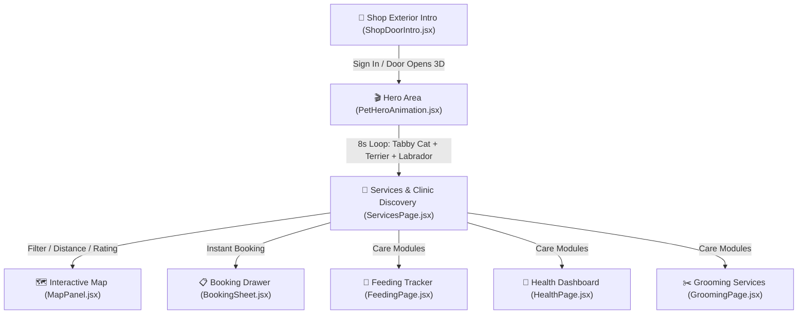

# 🐾 PetCare — Paws & Pals Interactive Web Application

A production-ready, responsive React web application for **PetCare ("PetShop — Local Care & Supplies")**, built with React 18, Vite, Tailwind CSS, Lottie React, Framer Motion, and Leaflet Maps.

Features a **3D Shop Door Entrance**, an **8-second Looping Hero Pet Animation** (Grey Tabby Cat, Terrier, Labrador), comprehensive care management (Services, Grooming, Health, Feeding, Activity), and full `prefers-reduced-motion` accessibility support.

---

## ⚠️ Important Dependency & Markercluster Note

If a machine errors on `react-leaflet-markercluster`, **do NOT install it**; use `react-leaflet-cluster` or `supercluster` instead.

---

## 🌟 Interactive Flow & Architecture



---

## 🎨 Design System & Palette

| Token Name | Hex Code | Visual Preview | Purpose |
|---|---|---|---|
| **Primary Accent** | `#7BD389` | `🟢` | Collars, bandanas, verified badges, active states |
| **Awning Red** | `#A63D2F` | `🔴` | Shop awning stripes, emergency banners, primary CTAs |
| **Warm Wood** | `#7C5028` / `#C68F52` | `🤎` | Shop door frame, window trim, warm natural borders |
| **Sky Sunset** | `#F2A65A` → `#FCE2B0` | `🌅` | Exterior sky gradient, hero warmth |
| **Background Paper** | `#FAF9F6` | `⚪` | Main content card surfaces |
| **Tabby Fur Tone** | `#9CA3AF` / `#374151` | `🐱` | Grey Tabby cat base & stripes |

---

## 🎬 Hero Looping Pet Animation Deliverables

> [!NOTE]
> All deliverables are available in both `public/` (Vite web root) and project root folders (`lottie/`, `svg/`, `png/`, `fallback/`).

- 🐱 **Grey Tabby Cat**: Distinct tabby stripes (`#374151`), light belly (`#F3F4F6`), playful gait, green collar (`#7BD389`), gold tag.
- 🐕 **Small Terrier Dog**: Warm tan coat (`#D97706`), perky ears, rapid bouncy step rhythm, green collar (`#7BD389`).
- 🦮 **Medium Labrador Dog**: Golden coat (`#F59E0B`), athletic bounding stride, green bandana (`#7BD389`).

### File Deliverable Index

| Asset Type | File Path | Specs & Size |
|---|---|---|
| **Lottie JSON** | [`public/lottie/petshop-hero-animals.json`](file:///C:/Users/nevaa/.gemini/antigravity-ide/scratch/pet-care-react-app/public/lottie/petshop-hero-animals.json) | 11.8 KB (< 500KB limit), 60fps 8s loop |
| **Layered SVG** | [`public/svg/petshop-animals.svg`](file:///C:/Users/nevaa/.gemini/antigravity-ide/scratch/pet-care-react-app/public/svg/petshop-animals.svg) | 1440×400 standalone layered SVG |
| **Transparent WebP (Desktop)** | [`public/png/hero-animals-1440x900.webp`](file:///C:/Users/nevaa/.gemini/antigravity-ide/scratch/pet-care-react-app/public/png/hero-animals-1440x900.webp) | 1440×900 transparent sequence render |
| **Transparent WebP (Tablet)** | [`public/png/hero-animals-768x1024.webp`](file:///C:/Users/nevaa/.gemini/antigravity-ide/scratch/pet-care-react-app/public/png/hero-animals-768x1024.webp) | 768×1024 transparent sequence render |
| **Static Fallback PNG** | [`public/fallback/hero-static-with-tabby.png`](file:///C:/Users/nevaa/.gemini/antigravity-ide/scratch/pet-care-react-app/public/fallback/hero-static-with-tabby.png) | 1440×900 static scene for `prefers-reduced-motion` |

---

## ⚡ Key React Components

- 🚪 [`ShopDoorIntro.jsx`](file:///C:/Users/nevaa/.gemini/antigravity-ide/scratch/pet-care-react-app/src/components/ShopDoorIntro.jsx#L100-L175): Full-screen shop exterior scene with 3D door swing opening (`1.1s cubic-bezier`), camera easing zoom (`1.0s`), and foreground animal pass.
- 🐕 [`PetHeroAnimation.jsx`](file:///C:/Users/nevaa/.gemini/antigravity-ide/scratch/pet-care-react-app/src/components/PetHeroAnimation.jsx#L1-L90): Animation container handling Lottie player, SVG fallback, ground shadow masks, and `prefers-reduced-motion` static image rendering.
- 🗺️ [`MapPanel.jsx`](file:///C:/Users/nevaa/.gemini/antigravity-ide/scratch/pet-care-react-app/src/components/MapPanel.jsx): OpenStreetMap tile rendering with `react-leaflet-cluster` custom paw markers.
- 📋 [`BookingSheet.jsx`](file:///C:/Users/nevaa/.gemini/antigravity-ide/scratch/pet-care-react-app/src/components/BookingSheet.jsx): Interactive booking drawer with pet profile selector (`Silver Tabby Cat`, `Luna`, `Milo`, `Coco`), datepicker, and instant SMS confirmation toggle.

---

## ♿ Accessibility & Performance

> [!TIP]
> **Reduced Motion Support**:
> To test reduced-motion simulation in Google Chrome:
> Open DevTools (`F12`) → `Control + Shift + P` → Type `Rendering` → Set `Emulate CSS media feature prefers-reduced-motion: reduce`.
> The app will automatically render `hero-static-with-tabby.png` with no heavy continuous autoplaying animations.

- **GPU Acceleration**: Framer Motion transforms using composited `transform` & `opacity`.
- **Touch Targets**: Minimum 44×44px interactive bounds across form inputs and buttons.
- **Lazy Loading**: Animation payload deferred post initial hero paint (`lazyLoad={true}`).

---

## 🚀 Quick Start Guide

### 1. Installation

```bash
# Navigate to project directory
cd C:\Users\nevaa\.gemini\antigravity-ide\scratch\pet-care-react-app

# Install dependencies
npm install
```

### 2. Start Local Dev Server

```bash
npm run dev
```
Open `http://localhost:5173` in your browser.

### 3. Regenerate Vector & Asset Files

```bash
python generate_hero_assets.py
```

### 4. Build Production Bundle

```bash
npm run build
```

---

## 📁 Repository Structure Overview

```
pet-care-react-app/
├── public/
│   ├── lottie/
│   │   └── petshop-hero-animals.json       <-- Lottie JSON animation (< 500KB)
│   ├── svg/
│   │   └── petshop-animals.svg            <-- Layered SVG sprite
│   ├── png/
│   │   ├── hero-animals-1440x900.webp     <-- Desktop transparent render
│   │   └── hero-animals-768x1024.webp      <-- Tablet transparent render
│   └── fallback/
│       └── hero-static-with-tabby.png     <-- Static fallback for reduced-motion
├── src/
│   ├── components/
│   │   ├── PetHeroAnimation.jsx           <-- Lottie / SVG animation container
│   │   ├── ShopDoorIntro.jsx              <-- 3D door intro & exterior shop scene
│   │   ├── MapPanel.jsx                   <-- Leaflet OpenStreetMap + clustering
│   │   ├── ServiceCard.jsx                <-- Care provider card
│   │   └── BookingSheet.jsx               <-- Quick booking modal drawer
│   ├── pages/
│   │   ├── ServicesPage.jsx               <-- Main landing & discovery hero
│   │   ├── FeedingPage.jsx                <-- Nutrition tracker
│   │   ├── HealthPage.jsx                 <-- Health records & vaccination
│   │   └── GroomingPage.jsx               <-- Groomer booking
│   ├── App.jsx
│   ├── index.css
│   └── main.jsx
├── generate_hero_assets.py                <-- Asset generator script
├── tailwind.config.js
├── vite.config.js
└── package.json
```
